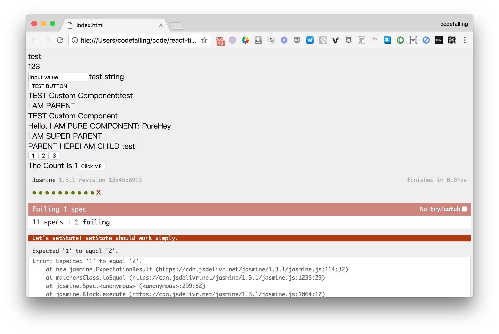

# 单元测试

我们将使用 jasmine 来编写自动化测试案例，它能运行在浏览器中进行自动化测试，并且直接在 HTML 上提供测试的结果。



## 为什么需要单元测试
由于一些操作是每次测试时都需要的，例如创建一个容器并且渲染到页面上，所以我们把他放在公共的函数中做。有些同学对于前端测试可能比较陌生，认为前端没必要写测试或者只有非常严肃的项目才写测试。其实在这个例子中整体的需求非常稳定，写单元测试除了是为了保证质量外，也是极大程度上避免了重复劳动。针对于 react-tiny 的测试就是**为了替代我们的手工验证**，例如说点击一个按钮然后查看其标题是否变化。

公用的函数，用于创建一个容器，并且给他加上一个 append 方法，可以直接 append 到测试容器中，并返回其第一个子节点（这往往是测试的对象）。

```js
function createContainer(name) {
    const container = document.createElement('div');
    container.setAttribute('id', 'test-container-' + name);
    container.append = (con = document.body) => {
        con.appendChild(container);
        return container.childNodes[0];
    };
    return container;
}
```

下面我们就来写第一个测试案例

```js
describe('Render', () => {
    it('<div>test</div> should be render as <div>test</div>', function () {
        const con = createContainer('render-simple');
        React.render(<div>test</div>, con);

        // 获取 append 进去的元素
        const target = con.append();

        expect(target.nodeName.toUpperCase()).toEqual('DIV');
        expect(target.innerText).toEqual('test');
    });
});
```

以上面的测试案例为例，我们先实现一个简单的 `Render` 函数，只要能够渲染 `<div>test</div>`。在完成功能后我们需要检查是否真的渲染出来一个 `div` 标签，标签的文字内容是否真为 `test`。这是一个很简单的测试案例，一旦写好后我们就可以精确、高效地检测功能是否正确，比肉眼更为可靠。

除此之外，当我们的功能越来越多越来越复杂的时候，不可能一遍一遍的去重新回归每一个功能，而单元测试一旦写完就会忠实的执行检查。